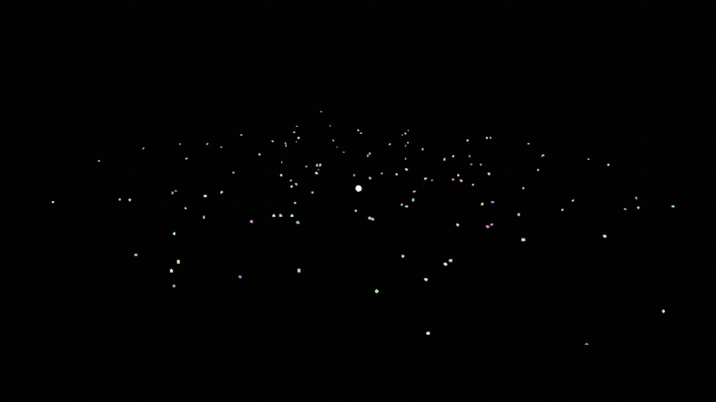

# Caldera: Simulation 

GPU-driven gravity simulation between the **128** planets. Used **modern Vulkan 1.4+** and 
features like `Synchronization 2`, `Dynamic Rendering`, and other.

Passes and graph:

## Load graph

Writes generated planet's data to staging buffer, then copies it to the `Planet Buffer`.
_Planet_ is a point described [here](include/caldera-examples-simulation/simulation.h). 

Resources:

- `Staging Buffer` a CPU-GPU memory proxy
- `Planets Buffer` stores generated planet's data

Graph Passes:

- **Staging Pass**: writes planet's data to the staging buffer
- **Transfer Pass**: with transfer operations copies data from the staging buffer to
  the planets buffers

## Draw Graph

This pass draws the planets. Called every frame. On the first one, waits timeline semaphore
signaled after loading planets

Managed resources:
- `Planets Buffer` is read as a points input
- `Swapchain Image` render target for the simulation
- `Depth Image` image for depth test. Will be more useful later 

Passes:
- **Gravity Pass**: computes velocities of planets and applies it
- **Draw Pass**: uses the planets buffers as an input data and draws it
- **Present Pass**: changing _ColorAttachment_ layout to _PresentSource_

## Resources

Feel free to edit the whole application code.

`Compute Pipeline` accepts input data as descriptor: 
- `Planet Buffer` as struct of
  - `position_and_mass` vec4, where `x`, `y`, and `z` mean world position and `w` means mass 
  - `color_and_radius`, vec4, where `x`, `y`, and `z` mean RGB color and `w` means planet radius
  - `speed` vec4, where `x`, `y`, and `z` mean world velocity of planets (`w` is padding)

`Graphics Pipeline` takes the same `Planet Buffer` as a vertex input.   

Both Pipelines (`Compute Pipeline` and `Graphics Pipeline`) take push constants:
- `cameraMatrix` - camera's `proj * view` float matrix 4x4
- `deltaTime` - float, time of the frame
- `timeSpeed` - game time multiplier, float

